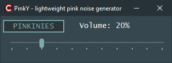

**Pinky** is a minimalist, native windows utility built with c++ builder (vcl). it generates high-quality pink noise to mask background distractions, helping you stay in the "flow state" during engineering tasks or study sessions.

### why pinky?
unlike standard white noise which can be harsh, pinky uses a **voss-mccartney algorithm** with 12 generators to create a deep, natural sound—similar to falling rain or a distant waterfall. 

### features:
*   **12-octave pink noise:** high-fidelity algorithmic generation (no loops, no patterns).
*   **wasapi shared mode:** works perfectly in parallel with winamp, youtube, or spotify.
*   **ultra-lightweight:** minimal cpu and ram footprint thanks to native vcl code.
*   **portable:** single .exe file. no installation, no registry clutter.
*   **xorshift rnd:** high-performance random generator to ensure zero audible patterns.

### how to use:
1.  download `pinky.exe` from the [releases](../../releases) section.
2.  click the **pinkinies** button to start the focus cloud.
3.  adjust the volume with the slider to blend with your environment.

### technical details:
*   built with: embarcadero c++ builder (vcl)
*   audio api: windows audio session api (wasapi)
*   font: lucida console (native windows support)

### support the project:
if Pinky helps you focus, consider supporting the developer:
**TRX (TRC20) address:** `TMb8KBGHng2URvhQcgW4hmmnqTpi8Frges`

---
*minimalist. native. effective.*

